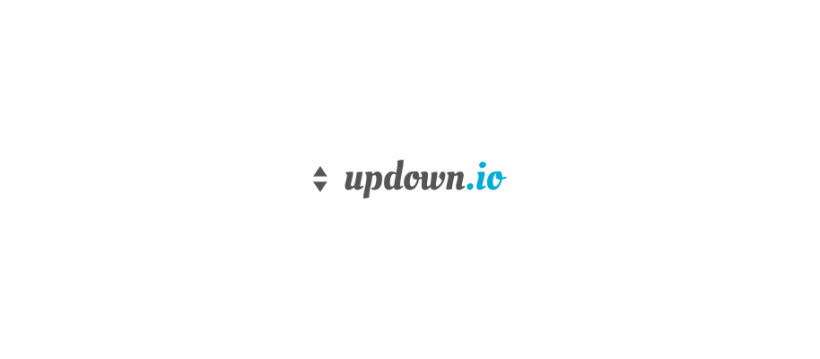

  
  
  
  
  
  

<a href="#ci-status">CI Status</a> • <a href="#contributing">Contributing</a> • <a href="#license">License</a>

 

`updown` is a Go package for working with the [updown.io](https://updown.io) [public API](https://updown.io/api).

> [!NOTE]
> **Please note that this package only supports retrieving data from the API (_i.e. you cannot create or modify checks with this package_).**

### CI Status

| Branch | Status |
|--------|----------|
| `master` |  |
| `develop` |  |

### Contributing

Before contributing to this project please read our [Contributing Guidelines](https://github.com/essentialkaos/contributing-guidelines#contributing-guidelines).

### License

[Apache License, Version 2.0](http://www.apache.org/licenses/LICENSE-2.0)

